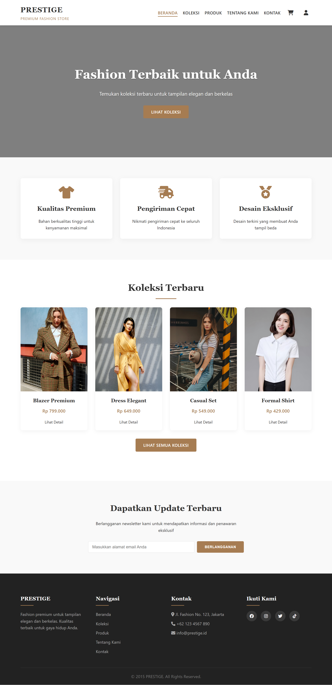

# Toko Baju Online

Website sederhana untuk toko baju online, dibuat menggunakan HTML, CSS, dan JavaScript. Website ini mencakup fitur dasar seperti katalog produk, keranjang belanja, checkout, dan halaman akun pengguna.

## Fitur Utama

- **Beranda (`index.html`)**: Menampilkan highlight produk dan navigasi utama.
- **Halaman Produk (`produk.html`)**: Daftar semua produk yang tersedia.
- **Keranjang Belanja (`keranjang.html`)**: Menampilkan produk yang ditambahkan ke keranjang.
- **Checkout (`checkout.html`)**: Formulir pengisian data pengiriman dan pembayaran.
- **Login & Daftar (`login.html`, `daftar.html`)**: Autentikasi pengguna.
- **Akun (`account.html`)**: Informasi akun pengguna.
- **Kontak (`kontak.html`)**: Informasi kontak toko.
- **Tentang Kami (`tentang-kami.html`)**: Informasi tentang toko.
- **Koleksi (`koleksi.html`)**: Menampilkan kategori atau koleksi produk tertentu.

## Struktur Proyek

```
toko baju/
├── index.html
├── produk.html
├── keranjang.html
├── checkout.html
├── login.html
├── daftar.html
├── account.html
├── kontak.html
├── tentang-kami.html
├── koleksi.html
├── css/
│   ├── account.css
│   ├── checkout.css
│   ├── daftar.css
│   ├── dropdown.css
│   ├── index.css
│   ├── keranjang.css
│   ├── koleksi.css
│   ├── kontak.css
│   ├── login.css
│   ├── produk.css
│   └── tentang-kami.css
├── js/
│   ├── checkout.js
│   ├── daftar.js
│   ├── dropdown.js
│   ├── keranjang.js
│   └── login.js
└── images/      # Gambar produk dan aset lainnya
```

## Cara Menjalankan

1. Ekstrak folder `toko baju` ke direktori lokal.
2. Buka file `index.html` menggunakan browser.

## Demo

Lihat demo proyek secara langsung di:
[http://apakahbisa.rf.gd](http://apakahbisa.rf.gd)

## Cuplikan Tampilan

Berikut adalah salah satu tampilan dari halaman website:




## Ringkasan Kode

### 🔧 JavaScript
- **checkout.js**: Menampilkan daftar kota secara dinamis berdasarkan provinsi yang dipilih pengguna.
- **daftar.js**: Mengatur visibilitas password saat pendaftaran.
- **dropdown.js**: Menampilkan menu dropdown akun pengguna.
- **keranjang.js**: Logika tambah/kurang jumlah barang.
- **login.js**: Fungsi serupa daftar.js untuk form login.

### 🎨 CSS
- **account.css**, **checkout.css**, **daftar.css**: Gaya khusus masing-masing halaman.
- **dropdown.css**: Dropdown menu akun.
- **index.css**: Tampilan utama beranda.
- **keranjang.css**, **produk.css**, **koleksi.css**, **kontak.css**, **tentang-kami.css**: Gaya halaman lain.


## Catatan

- Proyek ini bersifat statis dan tidak menggunakan backend.
- Untuk fungsionalitas dinamis (login, keranjang, checkout), perlu integrasi dengan server atau framework backend seperti PHP, Node.js, atau lainnya.


**Dibuat oleh:** [emyuel]
